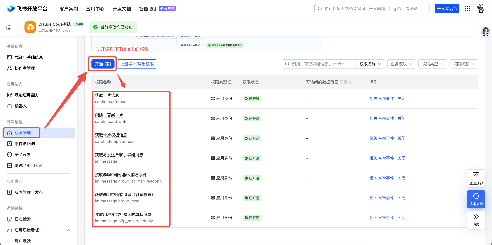

# imcc

将本机 Claude Code / Codex CLI 桥接到 IM 软件，让你在手机上随时通过飞书等与本机 agent 对话。

> Bridge your local Claude Code and Codex CLIs to IM apps

[](https://www.npmjs.com/package/imcc)
[](https://www.npmjs.com/package/imcc)
[](https://github.com/nangongwentian-fe/imcc)
[](https://github.com/nangongwentian-fe/imcc/issues)
[](LICENSE)
[](package.json)

## 特点

- **多 Provider**：同一个 `imcc` 同时支持 `Claude Code` 和 `Codex`
- **Profile 化**：`imcc setup` 每次创建一个 profile；一个 profile 绑定一个 provider + 一套 IM 配置
- **零容器**：直接调用本机 `claude` / `codex` CLI，继承本机配置
- **极简**：核心代码不到 500 行，无数据库，无后台服务
- **长连接**：基于飞书 WebSocket 长连接，无需公网 IP 或 tunnel
- **会话连续**：支持 `/sessions` 和 `/resume` 恢复本地 Claude / Codex 会话
- **单用户**：面向个人使用，安全、简单

## 支持 Provider

| Provider | 状态 |
|---|---|
| Claude Code | ✅ 可用 |
| Codex | ✅ 可用（v1 无飞书远程审批，默认自动执行） |

## 支持渠道

| 渠道 | 状态 |
|---|---|
| 飞书（Lark） | ✅ 可用 |
| Telegram | 🚧 基础框架保留，`setup` 暂未开放 |

## 快速开始

### 前置要求

- [Node.js](https://nodejs.org/) >= 18
- 已安装并可用的本地 CLI：
  - [Claude Code CLI](https://docs.anthropic.com/en/docs/claude-code)，或
  - `codex`

```bash
npm install -g @anthropic-ai/claude-code
```

如需使用 Codex，请确保本机已经能直接执行 `codex` 命令。

### 安装

```bash
npm install -g imcc
```

### 配置

```bash
imcc setup
```

`setup` 每次创建一个 profile。一个 profile 只绑定：

1. 一个 provider：`Claude Code` 或 `Codex`
2. 一个 profile 名称：如 `claude-main`、`codex-main`
3. 一套飞书 Bot 配置
4. 一组 provider 默认运行参数

如果你想同时把 Claude Code 和 Codex 都接进飞书，执行两次 `imcc setup` 即可。

注意：v1 不支持同一个飞书 Bot 被多个 profile 共享；请给每个 profile 配置独立的飞书应用 / Bot。

Codex profile 当前不走飞书远程审批，默认采用 `workspace-write + never` 自动执行模式。如果你需要更强限制或更高权限，可在 setup 时改成 `read-only` 或 `danger-full-access`。

### 启动

```bash
imcc start
imcc start --profile claude-main
```

行为说明：

- 没有 profile 时：`imcc start` 会自动进入 `setup`
- 只有一个 profile 时：直接启动它
- 有多个 profile 时：会让你先选择一个 profile

首次启动某个飞书 profile 后，按照终端提示完成飞书控制台的剩余配置：

**飞书控制台配置**

1. 进入飞书开放平台应用后台，先打开「开发配置」→「权限管理」→「开通权限」。
2. 搜索并开通以下权限：
   - 获取卡片信息：`cardkit:card:read`
   - 创建与更新卡片：`cardkit:card:write`
   - 获取卡片模板信息：`cardkit:template:read`
   - 获取与发送单聊、群组消息：`im:message`
   - 接收群聊中 @ 机器人消息事件：`im:message:group_at_msg:readonly`
   - 获取群组中所有消息（敏感权限）：`im:message:group_msg`
   - 读取用户发给机器人的单聊消息：`im:message:p2p_msg:readonly`
   - 消息权限用于收发私聊 / 群聊消息，卡片权限用于流式输出卡片与审批卡片
   - 以上权限以飞书后台当前页面展示为准，建议按这份清单全部开通，避免遗漏

权限管理页面示意：



3. 再打开「开发配置」→「事件与回调」。
4. 在「事件配置」页签中：
   - 将订阅方式设置为「使用长连接接收事件」
   - 点击「添加事件」
   - 添加 `im.message.receive_v1`
   - 展开该事件下的「所需权限」，确认页面列出的权限都已开通；这一步不能替代前面的「权限管理」页开通

事件配置页面示意：


5. 在「回调配置」页签中：
   - 将订阅方式设置为「使用长连接接收回调」
   - 点击「添加回调」
   - 添加 `card.action.trigger`
   - 如果没有订阅这个回调，审批卡片或交互卡片按钮点击不会回传到 imcc

回调配置页面示意：


6. 完成后进入「版本管理与发布」，发布应用版本。

### 使用

直接在飞书中向 Bot 发消息，即可与对应 profile 绑定的本机 CLI 对话。

**内置命令：**

| 命令 | 说明 |
|---|---|
| `/help` | 显示帮助信息 |
| `/clear` | 清除当前 session，开启新对话 |
| `/model <name>` | 切换模型（如 `claude-opus-4-6`） |
| `/cwd <path>` | 切换 Claude 工作目录 |
| `/sessions [n]` | 查看最近的本地会话 |
| `/resume <id前缀>` | 恢复指定会话 |
| `/perm ...` | 审批 Claude 工具权限（仅 Claude profile） |

## 配置文件

配置保存在 `~/.imcc/config.json`，现在采用 `profiles` 模型：

```json
{
  "version": 2,
  "lastProfile": "claude-main",
  "profiles": {
    "claude-main": {
      "name": "claude-main",
      "provider": "claude",
      "runtime": {
        "cwd": "~/projects",
        "timeoutMs": 300000,
        "permissionTimeoutMs": 30000
      },
      "channel": {
        "type": "lark",
        "appId": "cli_xxx",
        "appSecret": "xxx",
        "allowedUserIds": []
      }
    },
    "codex-main": {
      "name": "codex-main",
      "provider": "codex",
      "runtime": {
        "cwd": "~/projects",
        "timeoutMs": 300000,
        "permissionTimeoutMs": 30000
      },
      "codex": {
        "sandboxMode": "read-only",
        "approvalPolicy": "never"
      },
      "channel": {
        "type": "lark",
        "appId": "cli_yyy",
        "appSecret": "yyy",
        "allowedUserIds": []
      }
    }
  }
}
```

| 字段 | 说明 | 默认值 |
|---|---|---|
| `profiles.<name>.provider` | 绑定的 provider：`claude` / `codex` | 必填 |
| `profiles.<name>.runtime.cwd` | 该 profile 的默认工作目录 | `~` |
| `profiles.<name>.runtime.timeoutMs` | 单次响应超时时间（毫秒），`0` 表示不超时 | `300000` |
| `profiles.<name>.runtime.permissionTimeoutMs` | 工具审批等待时间（毫秒），`0` 表示一直等待 | `30000` |
| `profiles.<name>.channel` | 该 profile 的 IM 渠道配置 | 必填 |
| `profiles.<name>.codex.*` | Codex 专属执行模式配置 | `workspace-write` + `never` |

旧版单 Claude 配置会在首次读取时自动迁移到 `claude-default` profile。

## 工作原理

```
飞书消息
  → WebSocket 长连接（飞书 SDK）
  → profile 路由（鉴权 + 白名单）
  → spawn: claude / codex
  → 捕获 stdout
  → 回复飞书消息
```

每条消息 fork 一次 provider 进程。会话状态由 Claude Code / Codex 自身管理（`~/.claude/`、`~/.codex/`），imcc 只保存 profile 配置，不存储对话正文。

## 开机自启（macOS）

创建 `~/Library/LaunchAgents/dev.imcc.plist`：

```xml
<?xml version="1.0" encoding="UTF-8"?>
<!DOCTYPE plist PUBLIC "-//Apple//DTD PLIST 1.0//EN" "http://www.apple.com/DTDs/PropertyList-1.0.dtd">
<plist version="1.0">
<dict>
  <key>Label</key>
  <string>dev.imcc</string>
  <key>ProgramArguments</key>
  <array>
    <string>/bin/sh</string>
    <string>-c</string>
    <string>imcc start --profile claude-main</string>
  </array>
  <key>EnvironmentVariables</key>
  <dict>
    <key>PATH</key>
    <string>/usr/local/bin:/usr/bin:/bin:/opt/homebrew/bin</string>
  </dict>
  <key>RunAtLoad</key>
  <true/>
  <key>KeepAlive</key>
  <true/>
  <key>StandardOutPath</key>
  <string>/tmp/imcc.log</string>
  <key>StandardErrorPath</key>
  <string>/tmp/imcc.error.log</string>
</dict>
</plist>
```

```bash
launchctl load ~/Library/LaunchAgents/dev.imcc.plist
```

查看日志：

```bash
tail -f /tmp/imcc.log
```

## 与同类项目对比

| 项目 | 定位 |
|---|---|
| OpenClaw | 多功能 AI Agent 平台，500k 行代码，70+ 依赖 |
| NanoClaw | OpenClaw 轻量替代，容器隔离，多 IM，多用户 |
| **imcc** | 个人用，无容器，直连本机 Claude Code / Codex 的极简桥接层 |

## 路线图

- [x] 飞书（Lark）WebSocket 长连接
- [x] Typing 表情回应（处理中提示）
- [x] 交互式 onboarding 引导
- [x] 飞书内命令系统（/help /clear /model /cwd /sessions /resume）
- [x] 多 provider profile（Claude Code / Codex）
- [ ] Telegram setup 支持
- [ ] `imcc status` 查看运行状态
- [ ] 开机自启配置向导（`imcc install`）
- [ ] 消息队列（避免并发请求丢失）
- [ ] Codex 远程权限审批

## 贡献

欢迎提交 Issue 和 Pull Request。

开发环境：

```bash
git clone https://github.com/nangongwentian-fe/imcc.git
cd imcc
npm install
npm run dev
```

## License

[MIT](LICENSE) © [nangongwentian-fe](https://github.com/nangongwentian-fe)
